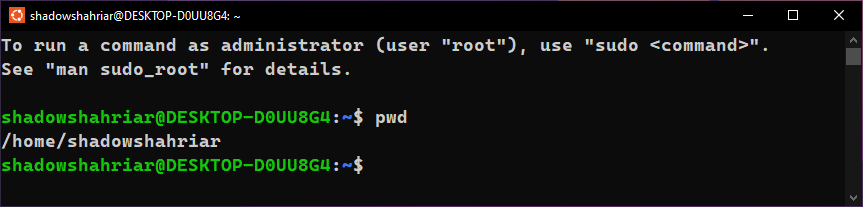
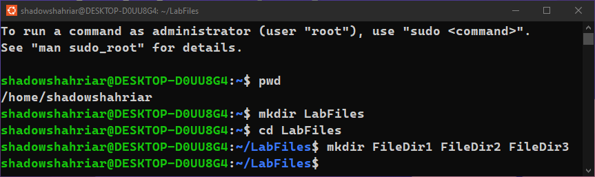
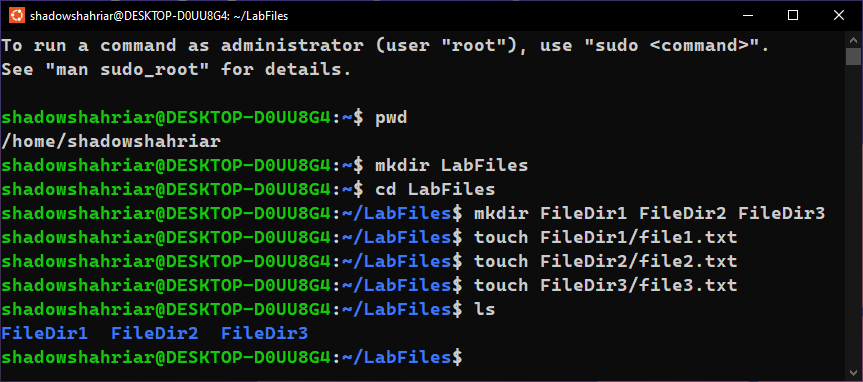
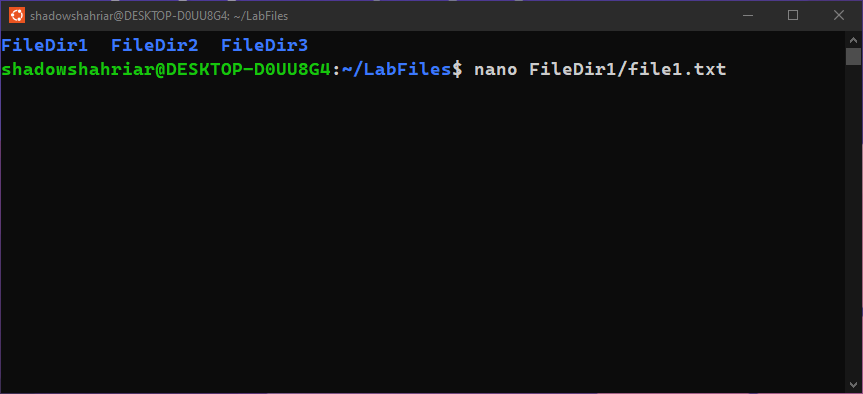
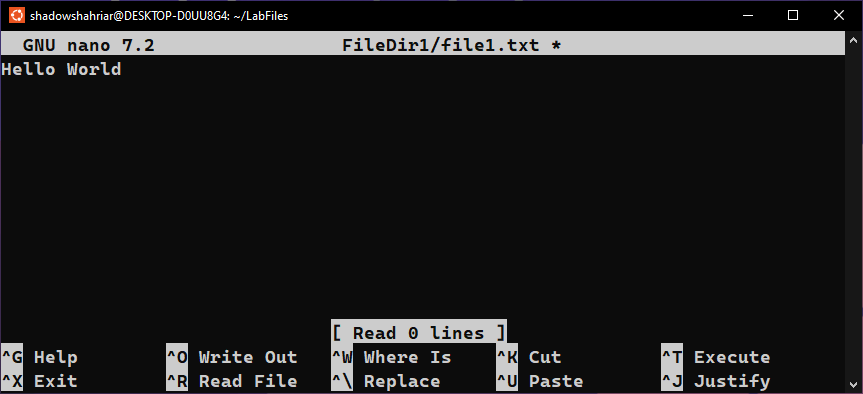
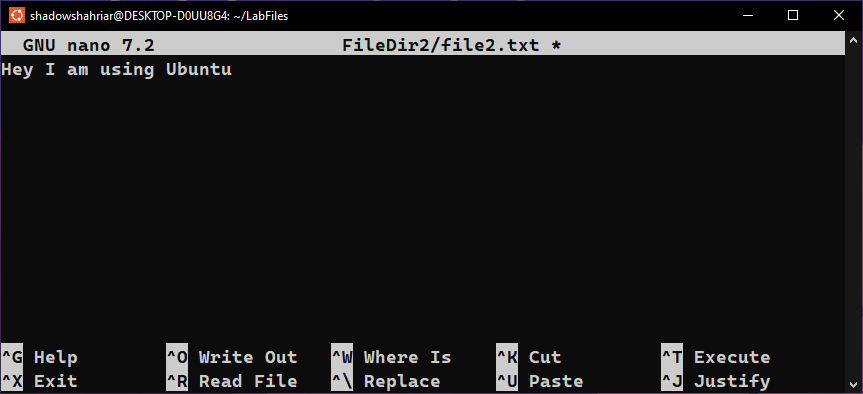
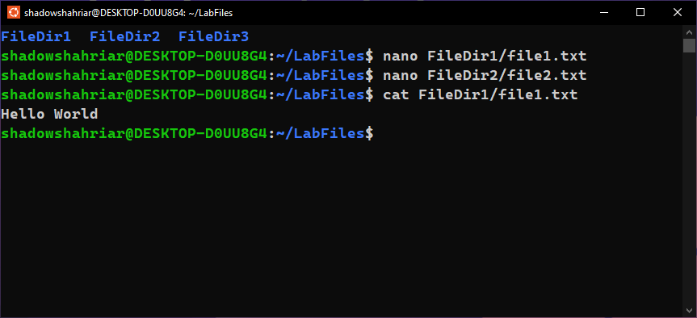
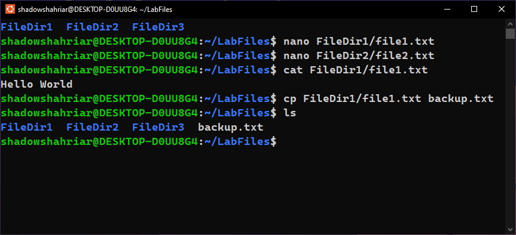
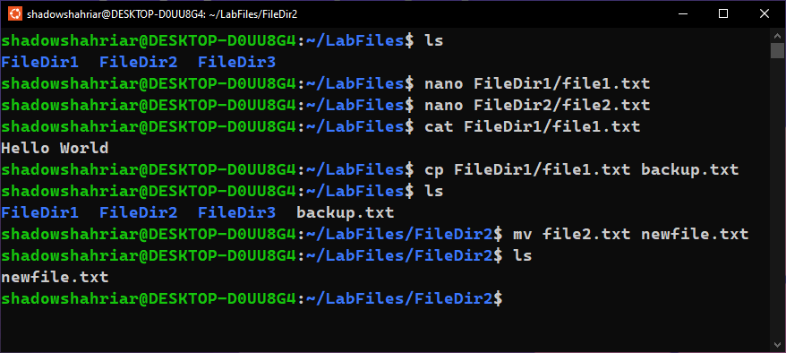
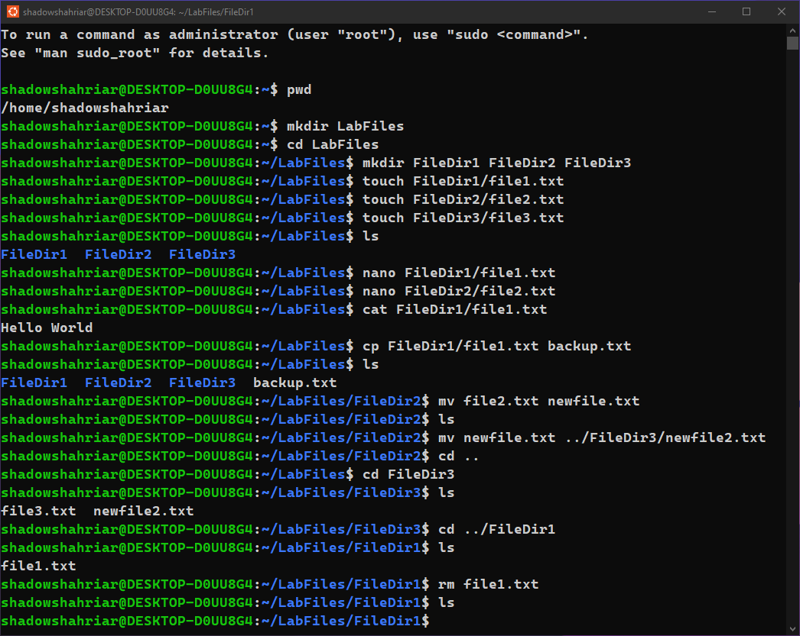

# Lab Report 1: Intro to CLI

## 1. Display the path of your current directory

```bash
pwd
```



## 2. Create a new directory called `LabFiles` in your home directory

```bash
mkdir LabFiles
```

## 3. Navigate into `LabFiles` directory

```bash
cd LabFiles
```

## 4. Create three new directories inside `LabFiles`

-   📁 FileDir1
-   📁 FileDir2
-   📁 FileDir3

```bash
mkdir FileDir1 FileDir2 FileDir3
```



## 5. Create three new files inside the new directories

-   📄 **file1.txt** inside 📁 **FileDir1**
-   📄 **file2.txt** inside 📁 **FileDir2**
-   📄 **file3.txt** inside 📁 **FileDir3**

```bash
touch FileDir1/file1.txt
touch FileDir2/file2.txt
touch FileDir3/file3.txt
```

## 6. List the files in the `LabFiles` directory

```bash
ls
```



## 7. Add some contents in the `file1.txt` and `file2.txt` file using the terminal

```bash
nano FileDir1/file1.txt
nano FileDir2/file2.txt
```







## 8. Display the contents of `file1.txt`

```bash
cat FileDir1/file1.txt
```



## 9. Make a copy of `file1.txt` called `backup.txt` in `LabFiles` directory

```bash
cp FileDir1/file1.txt backup.txt
```



## 10. Rename `file2.txt` to `newfile.txt`

```bash
mv file2.txt newfile.txt
```



## 11. Move `newfile.txt` to the `FileDir3` changing its name to `newfile2.txt`

```bash
mv newfile.txt ../FileDir3/newfile2.txt
```

## 12. Remove `file1.txt` from the `FileDir1` directory

```bash
rm file1.txt
```


