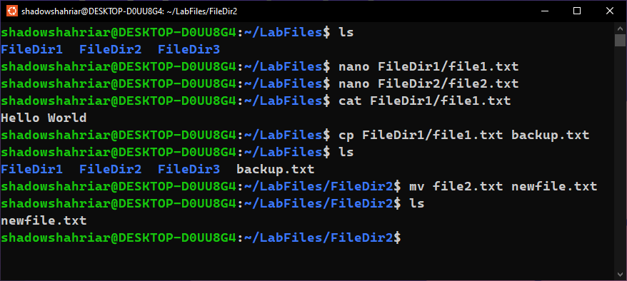

::: {#cover.border}

<section>
	
</section>
<section>
	<p class="h1 w800 underline text-upr">Lab Report</p>
	<table class="compact borderless table-large table-upr padless" style="width: 5.1in">
		<tr>
			<th>Course Title</th>
			<th>:</th><td>Operating Systems Lab</td>
		</tr>
		<tr>
			<th>Course Code</th>
			<th>:</th><td>CSE 210</td>
		</tr>
		<tr>
			<th>Lab Report No.</th>
			<th>:</th><td>01</td>
		</tr>
		<tr>
			<th>Submission Date</th>
			<th>:</th><td>29-07-2025</td>
		</tr>
	</table>
</section>
<section style="--hw: 7.2rem;">
	<p class="h2 w800 text-upr">Submitted To</p>
	<table class="compact borderless table-large table-upr padless withleader">
		<tr>
			<th>Name</th>
			<td>Mishal Al Rahman</td>
		</tr>
		<tr>
			<th>Dept. of</th>
			<td>Computer Science and Engineering (CSE)</td>
		</tr>
		<tr>
			<th></th>
			<td>Bangladesh University of Business & Technology (BUBT)</td>
		</tr>
	</table>
</section>
<section style="--hw: 7.2rem;">
	<p class="h2 w800 text-upr">Submitted By</p>
	<table class="compact borderless table-large table-upr padless withleader">
		<tr>
			<th>Name</th>
			<td>Shadman Shahriar</td>
		</tr>
		<tr>
			<th>ID No.</th>
			<td>20245103408</td>
		</tr>
		<tr>
			<th>Intake</th>
			<td>53</td>
		</tr>
		<tr>
			<th>Section</th>
			<td>1</td>
		</tr>
		<tr>
			<th>Program</th>
			<td>B.Sc. Engg. in CSE</td>
		</tr>
	</table>
</section>

:::

::: {.centered-heading}

# Operating Systems Lab

:::

### 1. Display the path of your current directory

```bash
pwd
```


### 2. Create a new directory called `LabFiles` in your home directory

```bash
mkdir LabFiles
```

### 3. Navigate into `LabFiles` directory

```bash
cd LabFiles
```

### 4. Create three new directories inside `LabFiles`

-   📁 FileDir1
-   📁 FileDir2
-   📁 FileDir3

```bash
mkdir FileDir1 FileDir2 FileDir3
```


### 5. Create three new files inside the new directories

-   📄 **file1.txt** inside 📁 **FileDir1**
-   📄 **file2.txt** inside 📁 **FileDir2**
-   📄 **file3.txt** inside 📁 **FileDir3**

```bash
touch FileDir1/file1.txt
touch FileDir2/file2.txt
touch FileDir3/file3.txt
```

### 6. List the files in the `LabFiles` directory

```bash
ls
```


### 7. Add some contents in the `file1.txt` and `file2.txt` file using the terminal

```bash
nano FileDir1/file1.txt
nano FileDir2/file2.txt
```


### 8. Display the contents of `file1.txt`

```bash
cat FileDir1/file1.txt
```


### 9. Make a copy of `file1.txt` called `backup.txt` in `LabFiles` directory

```bash
cp FileDir1/file1.txt backup.txt
```


### 10. Rename `file2.txt` to `newfile.txt`

```bash
mv file2.txt newfile.txt
```



### 11. Move `newfile.txt` to the `FileDir3` changing its name to `newfile2.txt`

```bash
mv newfile.txt ../FileDir3/newfile2.txt
```

### 12. Remove `file1.txt` from the `FileDir1` directory

```bash
rm file1.txt
```


