# Lab Report 2: User Management

## 1. Troubleshooting

**Task 1.1:** Use the `who` command to identify the currently logged-in users on the system.

```bash
who
```

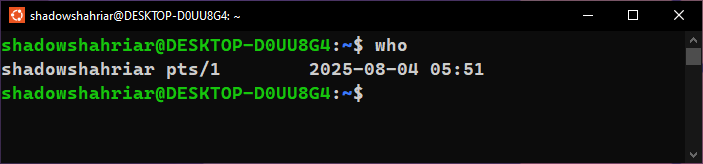

## 2. User Management

**Task 2.1:** Create a new user named **developer1** using the `useradd` command.

```bash
sudo useradd -m developer1
```

**Task 2.2:** Set a password for the newly created user using the `passwd` command.

```bash
sudo passwd
```

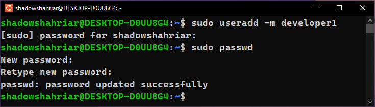

**Task 2.3:** Create a new group named **development** using the `groupadd` command.

```bash
sudo groupadd development
```

**Task 2.4:** Add the user **developer1** to the **development** group using the `usermod`
command.

```bash
sudo usermod -aG development developer1
```

**Task 2.5:** Check and display the group memberships of the user **developer1** using the `groups` command.

```bash
groups developer1
```

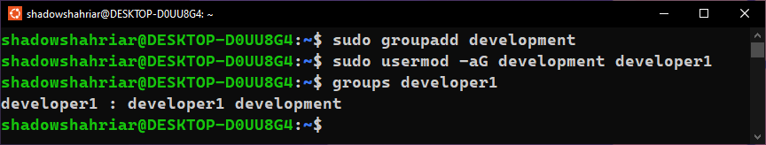

## 3. File Permission Adjustment

**Task 3.1:** Create a directory named **project_files** in the home directory of **developer1** using the `mkdir` command.

Logging into the **developer1** account:

```bash
sudo su - developer1
```

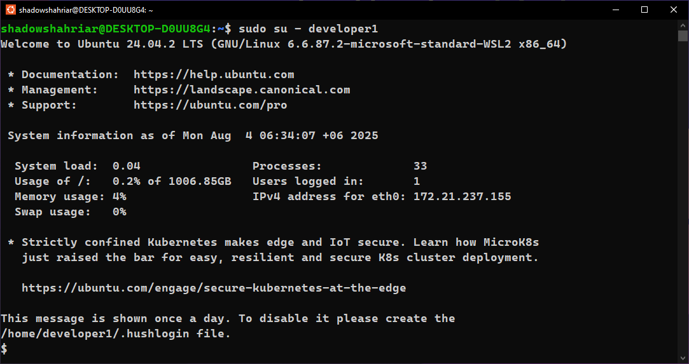

Verifying that we are logged in as **developer1**:

```bash
who
whoami
```

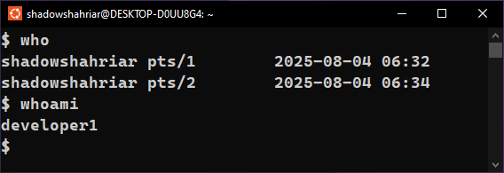

Verifying that we are in the correct working directory:

```bash
pwd
```

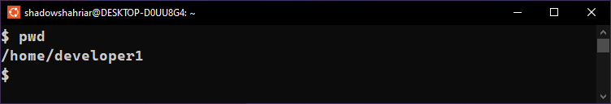

Creating the **project_files** directory:

```bash
mkdir project_files
```

**Task 3.2:** Change the ownership of the **project_files** directory to **developer1** and the group to **development** using the `chown` and `chgrp` commands.

```bash
chown developer1 project_files
chgrp development project_files
```

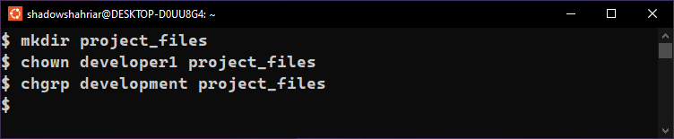

**Task 3.3:** Ensure that only the owner (**developer1**) has write permissions in the **project_files** directory.

```bash
chmod ua+w project_files
```


## 4. Additional Tasks

**Task 4.1:** Concatenate **file1.txt** and **file2.txt** to make a **file3.txt** with all the contents of **file1.txt** and **file2.txt**.

Creating a subdirectory named **shahriar408** in the **home directory** and navigating into it:

```bash
mkdir shahriar408
cd shahriar408
```

Creating two new files:

```bash
touch file1.txt
touch file2.txt
```

Adding contents to the newly created files using `nano`:

```bash
nano file1.txt
nano file2.txt
```

Verifying the contents of **file1.txt** and **file2.txt**:

```bash
cat file1.txt
cat file2.txt
```

Concatenate the contents of these two files into **file3.txt**:

```bash
cat file1.txt file2.txt > file3.txt
```

Verifying the contents of **file3.txt**:

```bash
cat file3.txt
```

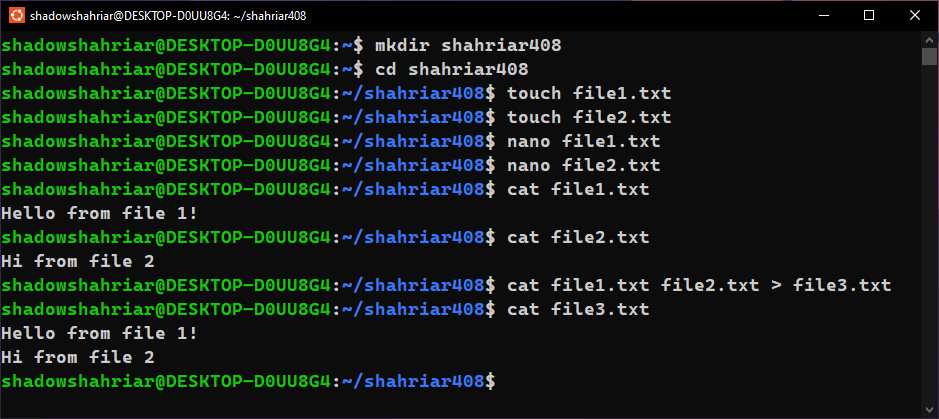

**Task 4.2:** Show the list of all running processes.

```bash
ps aux
```

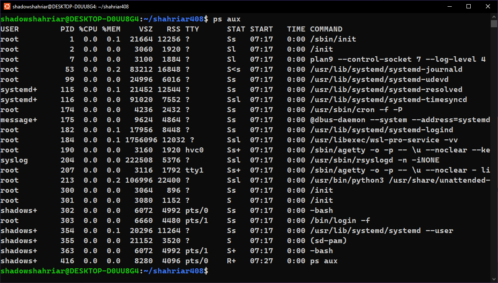

**Task 4.3:** Ping google.com.

```bash
ping google.com
```

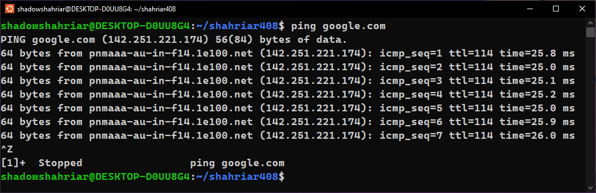

**Task 4.4:** Create an archive of the created folder.

```bash
tar -czvf archive.tar.gz shahriar408
```

**Task 4.5:** Decompress the archived folder.

```bash
tar -xzvf archive.tar.gz
```

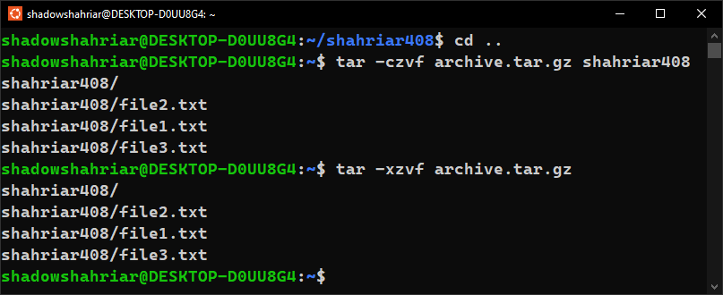

## 5. Conclusion

**Task 5.1:** Summarize your troubleshooting findings and the actions taken to resolve any issues.

Some of the low-level commands like `useradd`, `groupadd`, `usermod` required administritive permissions. Therefore, we had to use the `sudo` command and enter the password of the user account. We can delete the newly created user and group using the following commands:

```bash
sudo groupdel development
sudo userdel -r developer1
```

**Task 5.2:** Confirm that the new user developer1 has been successfully created, added to the development group, and that file permissions are set correctly.


