::: {#cover.border}

<section>
	
</section>
<section>
	<p class="h1 w800 underline text-upr">Lab Report</p>
	<table class="compact borderless table-large table-upr padless" style="width: 5.1in">
		<tr>
			<th>Course Title</th>
			<th>:</th><td>Operating Systems Lab</td>
		</tr>
		<tr>
			<th>Course Code</th>
			<th>:</th><td>CSE 210</td>
		</tr>
		<tr>
			<th>Lab Report No.</th>
			<th>:</th><td>02</td>
		</tr>
		<tr>
			<th>Submission Date</th>
			<th>:</th><td>04-08-2025</td>
		</tr>
	</table>
</section>
<section style="--hw: 7.2rem;">
	<p class="h2 w800 text-upr">Submitted To</p>
	<table class="compact borderless table-large table-upr padless withleader">
		<tr>
			<th>Name</th>
			<td>Mishal Al Rahman</td>
		</tr>
		<tr>
			<th>Dept. of</th>
			<td>Computer Science and Engineering (CSE)</td>
		</tr>
		<tr>
			<th></th>
			<td>Bangladesh University of Business & Technology (BUBT)</td>
		</tr>
	</table>
</section>
<section style="--hw: 7.2rem;">
	<p class="h2 w800 text-upr">Submitted By</p>
	<table class="compact borderless table-large table-upr padless withleader">
		<tr>
			<th>Name</th>
			<td>Shadman Shahriar</td>
		</tr>
		<tr>
			<th>ID No.</th>
			<td>20245103408</td>
		</tr>
		<tr>
			<th>Intake</th>
			<td>53</td>
		</tr>
		<tr>
			<th>Section</th>
			<td>1</td>
		</tr>
		<tr>
			<th>Program</th>
			<td>B.Sc. Engg. in CSE</td>
		</tr>
	</table>
</section>

:::

::: {.centered-heading}

# Operating Systems Lab

:::

## 1. Troubleshooting

**Task 1.1:** Use the `who` command to identify the currently logged-in users on the system.

**Solution:**

```bash
who
```

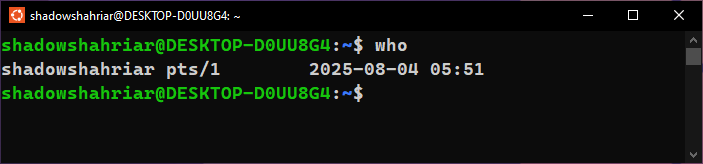

## 2. User Management

**Task 2.1:** Create a new user named **developer1** using the `useradd` command.

**Solution:**

```bash
sudo useradd -m developer1
```

**Task 2.2:** Set a password for the newly created user using the `passwd` command.

**Solution:**

```bash
sudo passwd
```

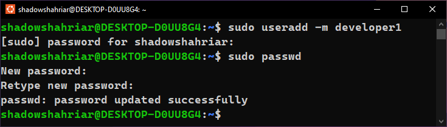

**Task 2.3:** Create a new group named **development** using the `groupadd` command.

**Solution:**

```bash
sudo groupadd development
```

**Task 2.4:** Add the user **developer1** to the **development** group using the `usermod`
command.

**Solution:**

```bash
sudo usermod -aG development developer1
```

**Task 2.5:** Check and display the group memberships of the user **developer1** using the `groups` command.

**Solution:**

```bash
groups developer1
```

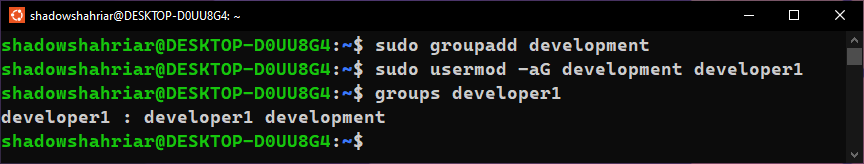

## 3. File Permission Adjustment

**Task 3.1:** Create a directory named **project_files** in the home directory of **developer1** using the `mkdir` command.

**Solution:**

Logging into the **developer1** account:

```bash
sudo su - developer1
```


Verifying that we are logged in as **developer1**:

```bash
who
whoami
```

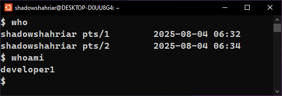

Verifying that we are in the correct working directory:

```bash
pwd
```

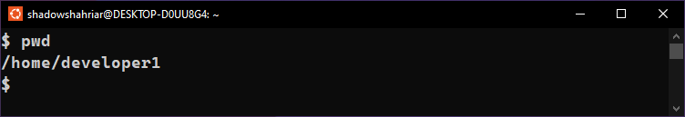

Creating the **project_files** directory:

```bash
mkdir project_files
```

**Task 3.2:** Change the ownership of the **project_files** directory to **developer1** and the group to **development** using the `chown` and `chgrp` commands.

**Solution:**

```bash
chown developer1 project_files
chgrp development project_files
```

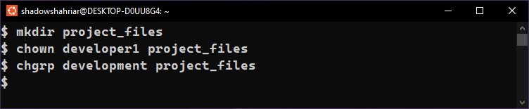

**Task 3.3:** Ensure that only the owner (**developer1**) has write permissions in the **project_files** directory.

**Solution:**

```bash
chmod ua+w project_files
```

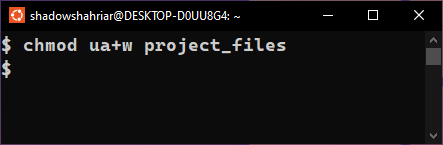

## 4. Additional Tasks

**Task 4.1:** Concatenate **file1.txt** and **file2.txt** to make a **file3.txt** with all the contents of **file1.txt** and **file2.txt**.

**Solution:**

Creating a subdirectory named **shahriar408** in the **home directory** and navigating into it:

```bash
mkdir shahriar408
cd shahriar408
```

Creating two new files:

```bash
touch file1.txt
touch file2.txt
```

Adding contents to the newly created files using `nano`:

```bash
nano file1.txt
nano file2.txt
```

Verifying the contents of **file1.txt** and **file2.txt**:

```bash
cat file1.txt
cat file2.txt
```

Concatenate the contents of these two files into **file3.txt**:

```bash
cat file1.txt file2.txt > file3.txt
```

Verifying the contents of **file3.txt**:

```bash
cat file3.txt
```

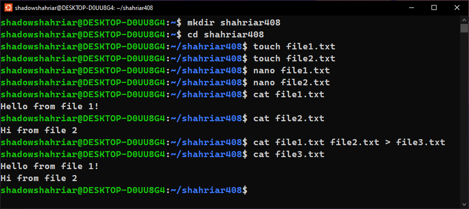

**Task 4.2:** Show the list of all running processes.

**Solution:**

```bash
ps aux
```

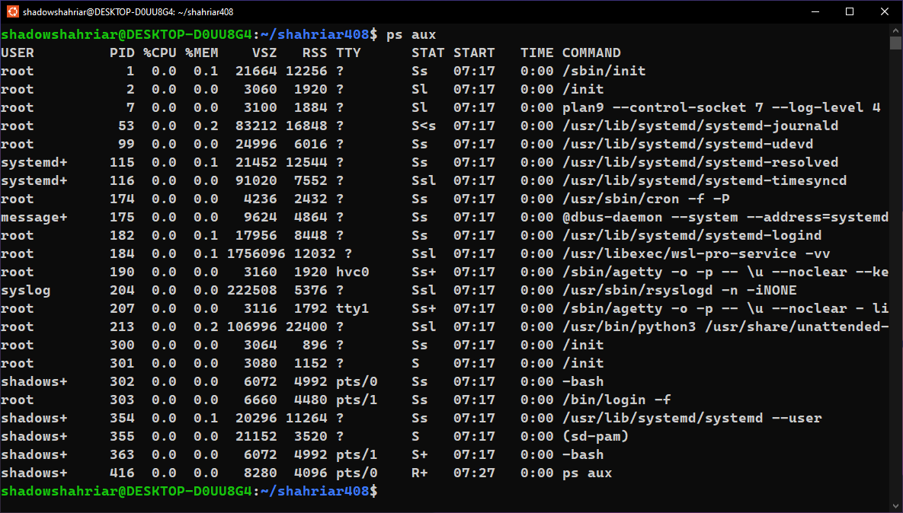

**Task 4.3:** Ping google.com.

**Solution:**

```bash
ping google.com
```

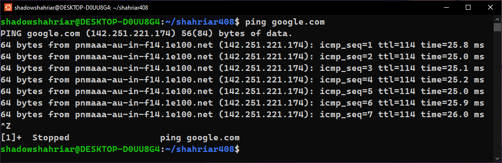

**Task 4.4:** Create an archive of the created folder.

**Solution:**

```bash
tar -czvf archive.tar.gz shahriar408
```

**Task 4.5:** Decompress the archived folder.

**Solution:**

```bash
tar -xzvf archive.tar.gz
```

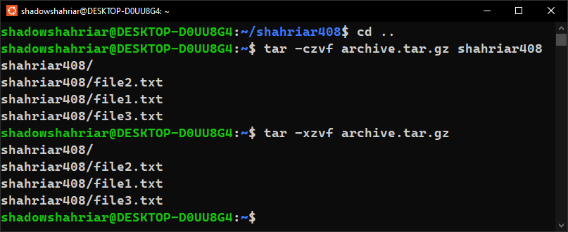

## 5. Conclusion

**Task 5.1:** Summarize your troubleshooting findings and the actions taken to resolve any issues.

**Solution:**

Some of the low-level commands like `useradd`, `groupadd`, `usermod` required administritive permissions. Therefore, we had to use the `sudo` command and enter the password of the user account. We can delete the newly created user and group using the following commands:

```bash
sudo groupdel development
sudo userdel -r developer1
```

**Task 5.2:** Confirm that the new user developer1 has been successfully created, added to the development group, and that file permissions are set correctly.

**Solution:**


