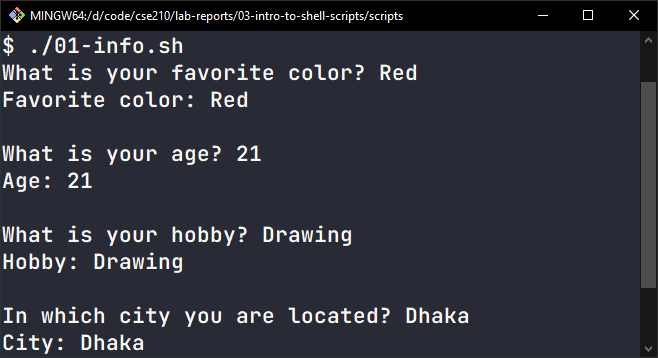
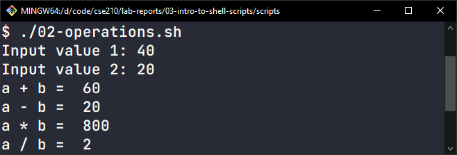
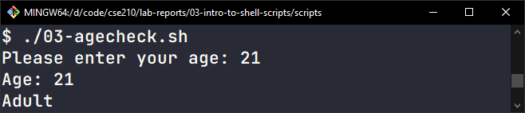
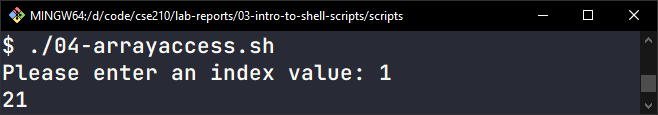

# Lab Report 3: Introduction to Shell Scripting

## Creating Shell Scripts

-   Create a new directory inside `$HOME` and navigate to it:

    ```bash
    mkdir shahriar408
    cd shahriar408
    ```

-   Create a text file with a `.sh` extension and change its permission to run it as an executable:
    ```bash
    nano demo.sh
    chmod +x demo.sh
    ```

**📄 demo.sh**

```bash
#!/bin/bash
echo "Hello World"
a=10
c=25
d=$(($a+$c))
echo $d

b=Hello
read b
echo $b

read -p "What is your name? " x
echo $x

arr=("apple" "banana" "orange" "kiwi")
echo ${arr[0]}

if [ $a -gt 5 ]; then
echo "True"
#elif
else
echo "False"
fi
```

## 1. User Details

-   Create a bash script named `info.sh`
    ```
    nano info.sh
    ```
-   Ask the user for their favorite color by echoing “What is your favorite color?”
-   Store the color in a variable
-   Print the stored variable in the following way:
    ```
    Favorite color: Blue
    ```
-   Similarly, ask for the age, hobby, and city separately:

    ```bash
    #!/bin/bash
    read -p "What is your favorite color? " favcolor
    echo "Favorite color:" $favcolor

    echo ""

    read -p "What is your age? " age
    echo "Age:" $age

    echo ""

    read -p "What is your hobby? " hobby
    echo "Hobby:" $hobby

    echo ""

    read -p "In which city you are located? " city
    echo "City:" $city
    ```

    

## 2. Basic Operations

-   Create a bash script named `operations.sh`
    ```
    nano operations.sh
    ```
-   Take two integer inputs for numbers
-   Perform the following operations and print the results:

    -   Addition of the two numbers
    -   Subtraction (`a` minus `b`)
    -   Multiplication
    -   Division (integer division)

    ```bash
    #!/bin/bash
    read -p "Input value 1: " a
    read -p "Input value 2: " b

    echo "a + b = " $(($a + $b))
    echo "a - b = " $(($a - $b))
    echo "a * b = " $(($a * $b))
    echo "a / b = " $(($a / $b))
    ```

    

## 3. Age Comparison

-   Create a bash script named `agecheck.sh`
    ```
    nano agecheck.sh
    ```
-   Ask the user to input their age

    -   If the age is **18 or above**, print `Adult`
    -   Else, print `Minor`

    ```bash
    #!/bin/bash
    read -p "Please enter your age: " age
    echo "Age:" $age

    if [ $age -ge 18 ]; then
    echo "Adult"
    else
    echo "Minor"
    fi
    ```

    

## 4. Array Element Access

-   Create a bash script named `arrayaccess.sh`
    ```
    nano arrayaccess.sh
    ```
-   Create an array with at least **3 elements**: `name`, `age`, `city`
-   Take input from the user for an index number (**0/1/2**). Use the input index number to print the corresponding value from the array. _For example,_ if the user inputs **0**, print the value at **index 0** (`name`):

    ```bash
    #!/bin/bash
    array=("Shayan Shahriar" 21 "Dhaka")
    read -p "Please enter an index value: " index
    echo ${array[$index]}
    ```

    
