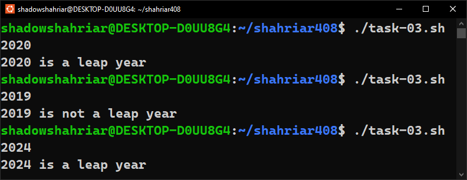

# Lab Report 4: Let's Loop

## Creating Shell Scripts

-   Create a new directory inside `$HOME` and navigate to it:

    ```bash
    mkdir shahriar408
    cd shahriar408
    ```

-   Create six `.sh` files for six individual tasks:

    ```bash
    touch task-01.sh
    touch task-02.sh
    touch task-03.sh
    touch task-04.sh
    touch task-05.sh
    touch task-06.sh
    ```

-   Change permissions of the `.sh` files to be able to run them as executables:

    ```bash
    chmod +x task-01.sh
    chmod +x task-02.sh
    chmod +x task-03.sh
    chmod +x task-04.sh
    chmod +x task-05.sh
    chmod +x task-06.sh
    ```

# Lab Tasks

## 1. Print the Pattern

Write a bash script to geenrate the following pattern:

**Input:**

```bash
5
```

**Output:**

```bash
*
**
***
****
*****
****
***
**
*
```

**Script:**

```bash
#!/bin/bash
read n

for ((i = 1; i <= n; i++)); do
	for ((j = 1; j <= i; j++)); do
		echo -n "*"
	done
	echo ""
done

for ((i = n - 1; i >= 0; i--)); do
	for ((j = 1; j <= i; j++)); do
		echo -n "*"
	done
	echo ""
done
```


## 2. Easy Fibonacci

Print the Fibonacci series in terminal with a bash script.

**Input:**

```bash
5
```

**Output:**

```bash
1 1 2 3 5
```

**Script:**

```bash
#!/bin/bash
read n

t1=0
t2=1
tn=$(($t1 + $t2))

echo -n "$t2 "

for ((i = 3; i <= n + 1; i++)); do
	echo -n "$tn "
	t1=$t2
	t2=$tn
	tn=$(($t1 + $t2))
done
echo ""
```


## 3. Leap Year

Write a bash script to find if a year is leap year or not.

> [!TIP]
> A leap is either divisible by 400 or 4 but not divisible by 100.

**Input:**

```bash
2020
```

**Output:**

```bash
2020 is a leap year.
```

**Script:**

```bash
#!/bin/bash
read year

divby4=$((year % 4))
divby400=$((year % 400))
divby100=$((year % 100))

if ([ $divby4 -eq 0 ] || [ $divby400 -eq 0 ]) && [ divby100 != 0 ]; then
	echo $year "is a leap year."
else
	echo $year "is not a leap year."
fi
```



## 4. Nearest Leap Year

Write a bash script to find the nearest leap year from the current year.

> [!TIP]
> If year **2023** is given as the input, then the nearest leap year is **2024**. If **2021** is given the nearest leap year is **2020**. If **2022** is given you can either print
> **2020** or **2024**.

**Input:**

```bash
2020
```

**Output:**

```bash
Nearest leap year: 2024
```

**Script:**

```bash
#!/bin/bash
read year

divby4=$((year % 4))
divby400=$((year % 400))
divby100=$((year % 100))

y1=$((year + 1))
y2=$((year - 1))

counter=1
while [ $counter -le 4 ]; do
	divby4=$((y1 % 4))
	divby400=$((y1 % 400))
	divby100=$((y1 % 100))
	if ([ $divby4 -eq 0 ] || [ $divby400 -eq 0 ]) && [ $divby100 != 0 ]; then
		# echo $y1
		break
	fi
	((y1++))
	((counter++))
done

counter=4
while [ $counter -ge 0 ]; do
	divby4=$((y2 % 4))
	divby400=$((y2 % 400))
	divby100=$((y2 % 100))
	if ([ $divby4 -eq 0 ] || [ $divby400 -eq 0 ]) && [ $divby100 != 0 ]; then
		# echo $y2
		break
	fi
	((y2--))
	((counter--))
done

forwards=$((y1 - year))
backwards=$((year - y2))

echo -n "Nearest leap year: "
if [ $backwards -lt $forwards ]; then
	echo $y2
else
	echo $y1
fi
```


## 5. Prime Number

Write a bash script to check whether a given number is a prime number.

**Input:**

```bash
7
```

**Output:**

```bash
7 is a prime number.
```

**Script:**

```bash
#!/bin/bash
read n

if [[ $n -le 1 ]]; then
	echo "$n is not a prime number."
	exit 0
fi

is_prime=true
for ((i = 2; i <= $n / 2; i++)); do
	if [ $((n % i)) -eq 0 ]; then
		is_prime=false
		break
	fi
done

if $is_prime; then
	echo "$n is a prime number."
else
	echo "$n is not a prime number."
fi
```


## 6. List Prime Numbers

Write a bash script to find and print all prime numbers between two given numbers (_inclusive_)

**Input:**

```bash
10
30
```

**Output:**

```bash
11 13 17 19 23 29
```

**Script:**

```bash
#!/bin/bash
read x
read y

if ([ $x -le 0 ] || [ $y -le $x ]); then
	echo "Range error"
	exit 0
fi

for ((i = x; i <= y; i++)); do
	if [ $i == 2 ] || [ $i == 3 ]; then
		echo -n "$i "
	fi
	prime=true
	for ((j = 2; j <= $i / 2; j++)); do
		if [ $((i % j)) -eq 0 ]; then
			prime=false
			break
		fi
	done
	if $prime; then
		echo -n "$i "
	fi
done

echo ""
```


