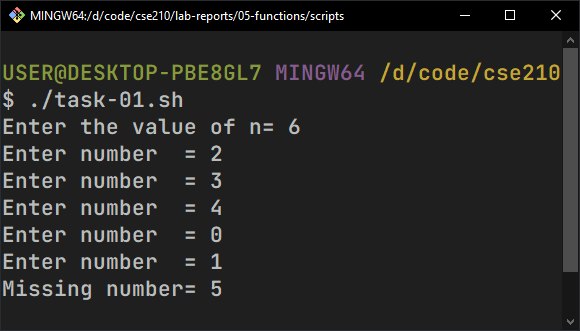
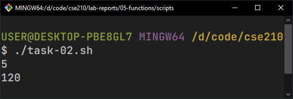
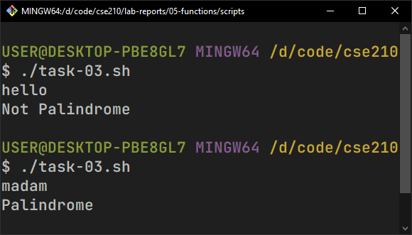
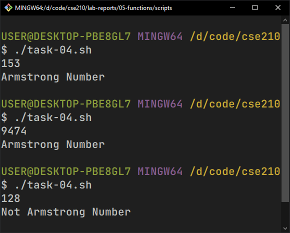
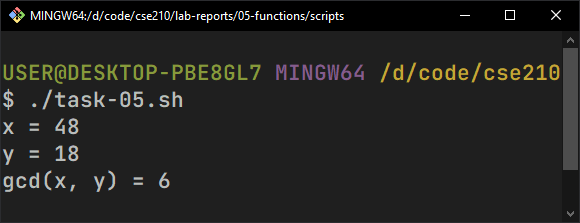

# Lab Report 5: Functions in Shell Scripting

## Creating Shell Scripts

-   Create a new directory inside `$HOME` and navigate to it:

    ```bash
    mkdir shahriar408
    cd shahriar408
    ```

-   Create six `.sh` files for six individual tasks:

    ```bash
    touch task-01.sh
    touch task-02.sh
    touch task-03.sh
    touch task-04.sh
    touch task-05.sh
    ```

-   Change permissions of the `.sh` files to be able to run them as executables:

    ```bash
    chmod +x task-01.sh
    chmod +x task-02.sh
    chmod +x task-03.sh
    chmod +x task-04.sh
    chmod +x task-05.sh
    ```

# Lab Tasks

## 1. Missing number

Given a range from 0 to n, a number is missing. Create a function to find that missing number and echo that number.

**Test Cases:**

```bash
Input : 0 3 2
Output: 1
```

```bash
Input : 0 3 1 2 5
Output: 4
```

**Script:**

```bash
#!/bin/bash

n=0
read -p "Enter the value of n= " n

real_sum=0
expected_sum=0
check_sum() {
	expected_sum=$(((n - 1) * (n) / 2))
	for ((i = 0; i < n - 1; i++)); do
		read -p "Enter number= " x
		real_sum=$(($real_sum + $x))
	done
	echo "Missing number=" $(($expected_sum - $real_sum))
}

check_sum
```



## 2. Factorial

Write a function that takes a number as input and returns its factorial.

**Input:**

```bash
5
```

**Output:**

```bash
120
```

**Script:**

```bash
#!/bin/bash

m=1
fact() {
	local f=$1
	if [ $1 -eq 1 ]; then
		echo $m
	else
		n=$(($1 - 1))
		m=$(($f * $m))
		fact $n
	fi
}

read n
fact $n
```



## 3. Palindrome Check

Write a function that checks if a string is a palindrome.

**Test Cases:**

```bash
Input : madam
Output: Palindrome
```

```bash
Input : hello
Output: Not Palindrome
```

**Script:**

```bash
#!/bin/bash

reversed=""
reverse_string() {
	str=$1
	rstr=$(echo "$str" | rev)
	reversed=$rstr
}

main() {
	read str
	reverse_string $str
	if [ $str == $reversed ]; then
		echo "Palindrome"
	else
		echo "Not Palindrome"
	fi
}

main
```



## 4. Armstrong Number Check

Write a function to check if a number is an Armstrong number.

**Test Cases:**

```bash
Input : 153
Output: Armstrong Number
```

```bash
Input : 123
Output: Not Armstrong Number
```

**Script:**

```bash
#!/bin/bash

read number
length=${#number}

armstrong_number() {
	sum=0
	for ((i = 0; i < length; i++)); do
		digit=${number:$i:1}
		power=1
		for ((x = 0; x < length; x++)); do
			power=$(($power * $digit))
		done
		sum=$(($sum + $power))
	done

	if [ $number -eq $sum ]; then
		echo "Armstrong Number"
	else
		echo "Not Armstrong Number"
	fi
}

armstrong_number
```



## 5. Greatest Common Divisor

Write a function that finds the GCD of two numbers.

**Input:**

```bash
12 18
```

**Output:**

```bash
6
```

**Script:**

```bash
#!/bin/bash
read -p "x = " x
read -p "y = " y

calc_gcd() {
	local a=$1
	local b=$2

	while [ $b -ne 0 ]; do
		r=$(($a % $b))
		a=$b
		b=$r
	done
	echo "gcd(x, y) =" $a
}

calc_gcd $x $y
```


