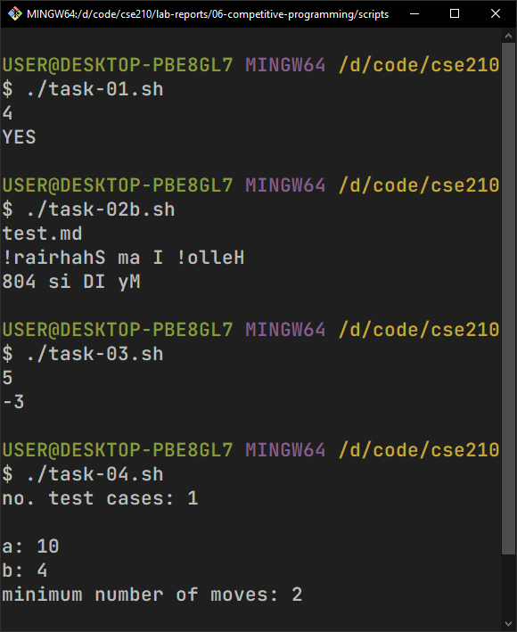

# Lab Report 6: Competitive Programming in Bash

## Creating Shell Scripts

-   Create a new directory inside `$HOME` and navigate to it:

    ```bash
    mkdir shahriar408
    cd shahriar408
    ```

-   Create six `.sh` files for six individual tasks:

    ```bash
    touch task-01.sh
    touch task-02.sh
    touch task-03.sh
    touch task-04.sh
    ```

-   Change permissions of the `.sh` files to be able to run them as executables:

    ```bash
    chmod +x task-01.sh
    chmod +x task-02.sh
    chmod +x task-03.sh
    chmod +x task-04.sh
    ```

# Lab Tasks

## 1. Watermelon

One hot summer day Pete and his friend Billy decided to buy a watermelon. They chose the biggest and the ripest one, in their opinion. After that the watermelon was weighed, and the scales showed w kilos. They rushed home, dying of thirst, and decided to divide the berry, however they faced a hard problem. Pete and Billy are great fans of even numbers, that's why they want to divide the watermelon in such a way that each of the two parts weighs even number of kilos, at the same time it is not obligatory that the parts are equal. The boys are extremely tired and want to start their meal as soon as possible, that's why you should help them and find out, if they can divide the watermelon in the way they want. For sure, each of them should get a part of positive weight.

**Input:**

The first (and the only) input line contains integer number `w (1 ≤ w ≤ 100)` — the weight of the watermelon bought by the boys.

**Output:**

Print `YES`, if the boys can divide the watermelon into two parts, each of them weighing even number of kilos; and `NO` in the opposite case.

**Script:**

```bash
#!/bin/bash
x=0
r=0
read x
r=$((x % 2))

if [ $r == 0 ]; then
	echo YES
else
	echo NO
fi
```

## 2. Reverse File Content

Given a filename, print the lines in reverse order.

**Test Cases:**

```bash
Input : [filename]
Output: [reversed file contents]
```

**Script:**

```bash
#!/bin/bash
read filename
while IFS= read -r line; do
	str=$(echo "$line")
	echo $str | rev
done <$filename
```

## 3. Algebra

For a positive integer _n_ let's define a function _f_:

```
f(n) = - 1 + 2 - 3 + .. + (( - 1)^n)n
```

Your task is to calculate _f(n)_ for a given integer _n_.

**Input:**

The single line contains the positive integer _n (1 ≤ n ≤ 10^15)_

**Output:**

Print _f(n)_ in a single line.

**Examples:**

```bash
Input : 4
Output: 2
```

```bash
Input : 5
Output: -3
```

**Note:**

-   _f(4) = - 1 + 2 - 3 + 4 = 2_
-   _f(5) = - 1 + 2 - 3 + 4 - 5 = - 3_

**Script:**

```bash
#!/bin/bash
sum=0
read n
for ((i = 1; i <= n; i++)); do
	sum=$(($sum + $i * (-1 ** i)))
done
echo $sum
```

## 4. Divisibility Problem

You are given two positive integers `a` and `b`. In one move you can increase a by 1 (replace `a` with `a+1`). Your task is to find the minimum number of moves you need to do in order to make **a divisible by b**. It is possible, that you have to make **0 moves**, as **a is already divisible by b**. You have to answer `t` independent test cases.

**Input:**

The first line of the input contains one integer _t (1 ≤ t ≤ 104)_ — the number of test cases. Then `t` test cases follow.

The only line of the test case contains two integers `a` and `b` _(1 ≤ a,b ≤ 109)_.

**Output:**

For each test case print the answer — **the minimum number of moves** you need to do in order to make **a divisible by b**.

**Examples:**

Input:

```bash
5
10 4
13 9
100 13
123 456
92 46
```

Output:

```bash
2
5
4
333
0
```

**Script:**

```bash
#!/bin/bash
read -p "no. test cases: " n
echo ""
for ((i = 0; i < n; i++)); do
	a=0
	b=0
	x=0
	r=-1
	read -p "a: " a
	read -p "b: " b
	while [ $(($r != 0)) -ne 0 ]; do
		a=$(($a + 1))
		r=$(($a % $b))
		x=$(($x + 1))
	done
	echo "minimum number of moves:" $x
	echo ""
done
```


